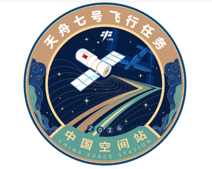

<!--
 * @Author: blueWALL-E
 * @Date: 2025-06-23 17:14:11
 * @LastEditTime: 2025-06-25 15:19:31
 * @FilePath: \Chinese Aerospace History\载人航天工程\载人航天工程任务简介.md
 * @Description: 载人航天工程任务简介
 * @Wearing:  Read only, do not modify place!!! 
 * @Shortcut keys:  ctrl+alt+/ ctrl+alt+z
-->

# 载人航天工程任务简介

## 任务简介与规划

中国载人航天工程是国家“高技术发展战略”的重点组成部分，工程于**1992年9月21日**正式立项，代号“921工程”。其目标是建设自主可控、技术先进的载人航天体系，实现中国人在太空中长期稳定驻留。

### 📌 中国载人航天“三步走”发展战略

1. **第一步**：突破载人航天基础技术  
   - 成功将航天员送入太空并安全返回  
   - 代表任务：神舟五号、六号（2003-2005）

2. **第二步**：突破出舱活动与交会对接技术  
   - 具备初步空间实验能力  
   - 代表任务：神舟七号（出舱）、神舟八至十号（交会对接天宫一号）

3. **第三步**：建成中国空间站，实现长期驻留与空间科学研究  
   - 代表任务：天和核心舱发射、神舟十二号起驻留任务

---

## 任务背景

### 📆 “921工程”立项背景

- **1986年3月**：启动“863计划”，航天被列为重点领域
- **1988年**：钱学森提出“可重复使用运载器”与“载人航天必要性”
- **1990年**：中国长城公司曾尝试参与国际空间站项目未果，决心自主发展
- **1992年9月21日**：中共中央、国务院批准“921工程”立项

---

## 组织架构

### 历任“两总”

**“两总”即总设计师与总指挥制度**，是我国重大装备研发体系的中枢机制之一，最早由《武器装备研制工作建立总设计师制度和行政指挥管理责任制的规定》确立。

| 阶段 | 总设计师 | 总指挥 | 备注 |
|------|----------|--------|------|
| 初期 | 王永志院士 | 胡世祥 | 神舟1-5 |
| 中期 | 周建平 | 张建启 | 神舟6-10 |
| 空间站阶段 | 周建平（兼） | 林西强 / 张航等 | 神舟十二号及后续 |

### 载人航天办公室

- 成立时间：1993年
- 隶属：国务院/中央军委装备发展部
- 职能：组织协调14大系统研制、任务统筹与国际合作
- 历任领导：
  - 胡世祥（初期主任）
  - 王兆耀、陈求发（后续主任）
  - **现任主任**：林西强（副总设计师出身）

---

### 十四个分系统介绍

> 官方来源：[中国载人航天工程网（www.cmse.gov.cn）](http://www.cmse.gov.cn)

#### 航天员系统

由航天员科研训练中心负责，承担航天员选拔、训练、医学保障、在轨支持等任务。

#### 空间应用系统

由中科院牵头，负责空间科学实验设计、成果应用，如微重力实验、地球观测、医学研究等。

#### 载人飞船系统

由航天科技集团五院研制，包括神舟系列飞船，具备安全返回与在轨交会对接能力。

#### 货运飞船系统

天舟系列货运飞船，为空间站提供补给、燃料、实验物资运送功能。

#### 长征二号F运载火箭系统

专为载人飞行改进的长征二号F型火箭，具备逃逸塔、安全控制系统。

#### 长征七号运载火箭系统

中型运载火箭，用于天舟货运飞船发射任务，首飞于2016年。

#### 长征五号B运载火箭系统

大推力火箭，用于空间站舱段（天和、问天、梦天）发射。

#### 酒泉发射场系统

主要用于神舟、天舟任务，具备全天候载人发射保障能力。

#### 文昌发射场系统

海南新建发射场，承担大型空间站舱段、长征五号发射任务。

#### 测控通信系统

由西安卫星测控中心、北京航天飞控中心组成，配合“天链”中继星网络进行测控。

#### 空间实验室系统

包括天宫一号、天宫二号，是空间站的前期验证平台。

#### 空间站系统

由“天和”核心舱、“问天”“梦天”实验舱组成，形成T字构型，具备长期驻留和科学实验能力。

#### 着陆场系统

负责返回舱精确回收与航天员安全着陆，由四子王旗主着陆场与东风备用场组成。

#### 光学舱系统

为舱外巡天设备和光学遥感提供平台，尚属保密部分，后期部署中。

---

## 历次发射任务列表

> 仅列部分代表性任务，其余可参考官方CMSA数据库

| 序号 | 任务名称 | 任务标识 | 运载火箭 | 发射时间 | 发射地点 | 着陆时间 | 着陆地点 | 任务时长 | 航天员 |
|------|----------|----------|----------|------------|------------|------------|----------------|------------|--------|
| 01 | 神舟五号 |  | 长征二号F | 2003-10-15 09:00 | 酒泉 | 2003-10-16 06:23 | 内蒙古四子王旗 | 21小时 | 杨利伟 |
| 06 | 神舟七号 |  | 长征二号F | 2008-09-25 21:10 | 酒泉 | 2008-09-28 17:37 | 四子王旗 | 68小时 | 翟志刚、刘伯明、景海鹏 |
| 12 | 神舟十二号 |  | 长征二号F | 2021-06-17 09:22 | 酒泉 | 2021-09-17 | 四子王旗 | 90天 | 聂海胜、刘伯明、汤洪波 |

（建议继续补全神舟1至17号任务 + 天和舱段发射等）

---

## 载人航天精神

### 精神来源

**首次提出时间**：2010年10月，神舟七号任务总结大会上提出  
**发布主体**：中国载人航天工程办公室  
**背景**：神七任务成功实现首次太空出舱，凝聚航天团队精神成果

### 精神解读

| 精神要素 | 解读 |
|----------|------|
| 特别能吃苦 | 面对极端测试环境与重复训练 |
| 特别能战斗 | 面对技术难题勇往直前 |
| 特别能攻关 | 面对关键节点集中科研力量 |
| 特别能奉献 | 舍小家为国家，默默无闻贡献 |

---

## 备注

- 本文件为中国载人航天工程全景式介绍，依据 CMSA 官方资料、新华社归档发布会内容整理
- 所有图片请存储于项目 `./images/` 目录，命名规范：`任务名称.png/jpg`

---
